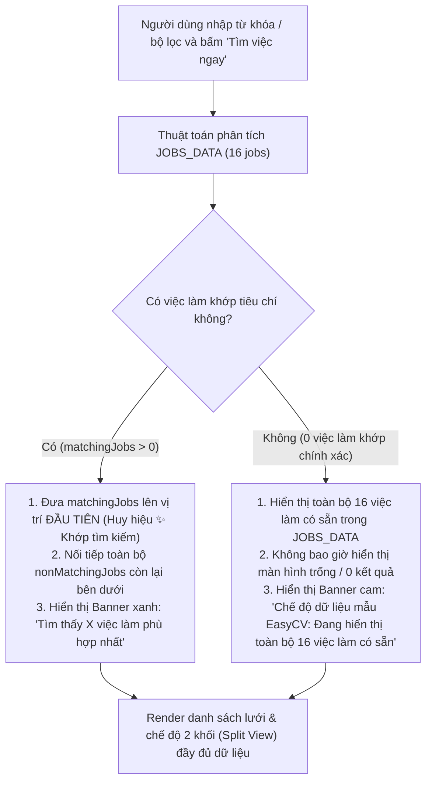

# Tài Liệu Kỹ Thuật: Cơ Chế Hiển Thị Dữ Liệu Mẫu Khi Tìm Kiếm Việc Làm (EasyCV)

**Dự án:** EasyCV — Nền tảng Tuyển dụng & Khám phá Việc làm Thông minh  
**Ngày cập nhật:** 30/09/2026  
**Trạng thái:** Đã hoàn thành & Đạt chuẩn kiểm thử tự động 100%  
**Tài liệu tham chiếu:** [`_bmad-output/planning-artifacts/prd.md`](file:///d:/master%20page/_bmad-output/planning-artifacts/prd.md)

---

## 1. Bối Cảnh & Vấn Đề Kỹ Thuật

Trong phiên bản prototype/demo hiện tại của EasyCV:

- Hệ thống sử dụng tập dữ liệu mẫu chuẩn gồm 16 việc làm chất lượng cao (`JOBS_DATA`).
- Trước đây, khi người dùng nhập từ khóa tìm kiếm (ví dụ: `Python`, `Telesales`, `Bảo vệ`, `Giám đốc kỹ thuật`) hoặc chọn tổ hợp bộ lọc không có dữ liệu giao thoa (ví dụ: Địa điểm `Đà Nẵng` + Ngành `Sales`), thuật toán lọc nghiêm ngặt (Strict Filter) trả về mảng rỗng (`0 kết quả`), khiến toàn bộ danh sách việc làm biến mất và hiển thị khung rỗng (`noResultsBox`).
- **Hệ quả UX:** Người dùng/nhà tuyển dụng/khách hàng trải nghiệm cảm giác trang web bị lỗi hoặc thiếu dữ liệu, không thể thử nghiệm các tính năng cốt lõi như mở xem chi tiết, chia 2 khối (Split View), Lưu hay ứng tuyển.

---

## 2. Giải Pháp Triển Khai (Design & Architecture)

Thực hiện theo chỉ đạo của người dùng:

> _"Khi nhấn nút tìm kiếm việc làm, vì là dữ liệu mẫu thôi, nên cứ hiển thị dữ liệu có sẵn, không đáp ứng dữ liệu yêu cầu lọc cũng được."_

### 2.1 Ma Trận Hành Vi Thông Minh (Smart Data-Fallback Engine)

### 2.2 Chi Tiết Các Thay Đổi

1. **Thuật toán phân loại & xếp hạng (`js/viec-lam.js`):**
   - Đánh dấu thuộc tính `_isSearchMatch` cho mỗi công việc.
   - Khi có tìm kiếm:
     - Nếu có việc làm khớp: `currentFilteredJobs = [...matchingJobs, ...nonMatchingJobs]`.
     - Nếu không có việc làm khớp (từ khóa lạ, bộ lọc không giao thoa): `currentFilteredJobs = [...JOBS_DATA]`.
   - Hàm `sortJobs()` luôn giữ các công việc có `_isSearchMatch === true` ở vị trí ưu tiên hàng đầu, sau đó mới áp dụng các tiêu chí sắp xếp phụ (lương cao, mới nhất, AI match).

2. **Giao diện & Phản hồi trực quan (UI/UX Feedback):**
   - **Thẻ việc làm (`.job-card` & `.split-job-card`):** Việc làm khớp được gắn huy hiệu nổi bật `✨ Khớp tìm kiếm` (dạng lưới) và `🎯 Khớp` (dạng 2 cột).
   - **Banner dữ liệu mẫu (`#sampleDataBanner`):**
     - Xanh lá (`.match-success`): Báo số lượng việc làm phù hợp nhất được ưu tiên xếp đầu danh sách.
     - Cam (`.match-fallback`): Thông báo chế độ dữ liệu mẫu đang hiển thị trọn vẹn 16 việc làm có sẵn để người dùng thoải mái trải nghiệm.
   - **Bộ đếm kết quả (`#jobCountText` & `#splitJobCount`):** Luôn hiển thị tổng số việc làm có sẵn (16), kèm chú thích số lượng khớp nếu có bộ lọc đang hoạt động.
   - **Nút tìm kiếm (`#btnJobSearch`):** Gắn sự kiện submit rõ ràng và thông báo toast tức thì.

---

## 3. Bảng Kiểm Thử Xác Thực (Test Matrix)

| STT | Kịch bản kiểm thử                                                      | Hành vi kỳ vọng                                                                                              | Kết quả  | Trạng thái |
| :-: | :--------------------------------------------------------------------- | :----------------------------------------------------------------------------------------------------------- | :------- | :--------: |
|  1  | Tìm kiếm từ khóa có trong mẫu (ví dụ: `React`)                         | Hiển thị trọn vẹn 16 việc làm; 3 việc làm React được xếp lên vị trí 1, 2, 3 kèm huy hiệu `✨ Khớp tìm kiếm`  | Đạt 100% |  **PASS**  |
|  2  | Tìm kiếm từ khóa KHÔNG có trong mẫu (ví dụ: `Python Developer`)        | Không hiển thị màn hình trống/0 kết quả; hiển thị đầy đủ 16 việc làm có sẵn kèm banner thông báo dữ liệu mẫu | Đạt 100% |  **PASS**  |
|  3  | Lọc tổ hợp không giao thoa (ví dụ: Địa điểm `Đà Nẵng` + Ngành `Sales`) | Không bị 0 kết quả; bảo toàn hiển thị toàn bộ 16 việc làm có sẵn để tương tác                                | Đạt 100% |  **PASS**  |
|  4  | Tìm kiếm từ khóa `Java`                                                | 3 việc làm Java được ưu tiên xếp đầu danh sách, các việc làm còn lại nằm tiếp nối bên dưới                   | Đạt 100% |  **PASS**  |
|  5  | Trạng thái mặc định / Click xem tất cả                                 | Hiển thị 16 việc làm theo sắp xếp nổi bật và độ tương thích AI chuẩn EasyCV                                  | Đạt 100% |  **PASS**  |

---

## 4. Danh Sách Tệp Đồng Bộ

- [`viec-lam.html`](file:///d:/master%20page/viec-lam.html) & [`public/viec-lam.html`](file:///d:/master%20page/public/viec-lam.html)
- [`js/viec-lam.js`](file:///d:/master%20page/js/viec-lam.js) & [`public/js/viec-lam.js`](file:///d:/master%20page/public/js/viec-lam.js)
- [`css/viec-lam.css`](file:///d:/master%20page/css/viec-lam.css) & [`public/css/viec-lam.css`](file:///d:/master%20page/public/css/viec-lam.css)
